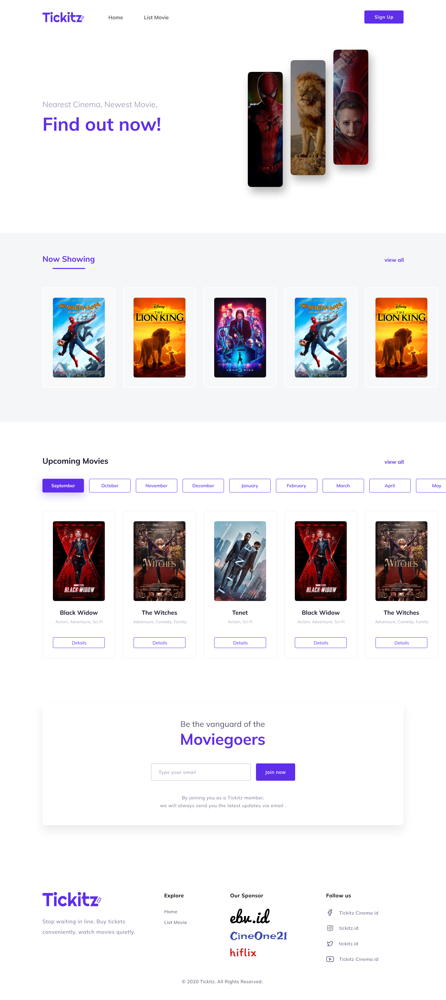
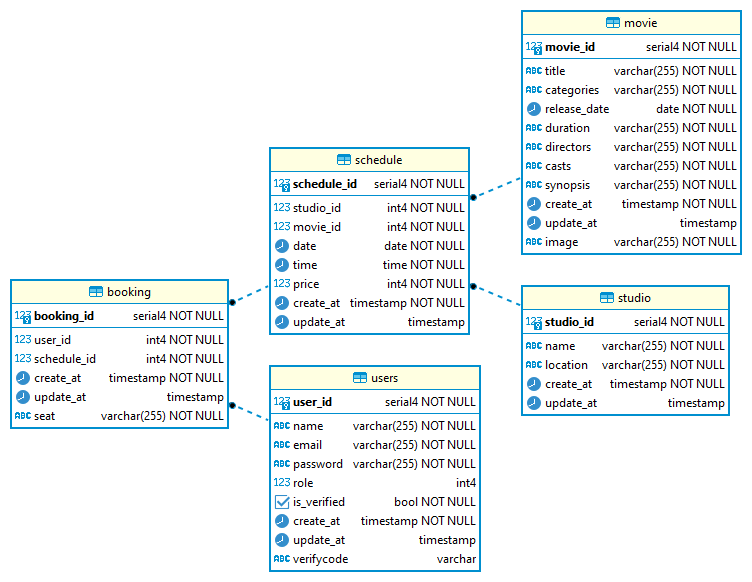

# Tickitz
Tickitz is a movie ticketing app designed for customers to book tickets and admins to post movie shows and schedules. This RESTful API built with ExpressJS and PostgreSQL.

## 🔥 Showcase
- Web Screenshot



- Database Schema



- [Postman Docs](https://documenter.getpostman.com/view/25042327/2s93JtQ3v8)

## ⚡ Features
- CRUD for all modules
- Authentication and Authorization
- Sorting, Filtering, Searching, and Pagination

## 💻 Built with
-   [NodeJS](https://github.com/nodejs/node) for the server side scripting
-   [Express JS](https://github.com/expressjs/express) for handling HTTP requests and responses
-   [JWT](https://github.com/auth0/node-jsonwebtoken) for authentication and authorization
-   [Postgres](https://github.com/postgres/postgres) for DBMS
-   [Sendinblue](https://github.com/sendinblue/APIv3-nodejs-library) for sending emails

## 🛠️ Installation Steps

1. Clone the project

```bash
git clone https://github.com/rfauzi44/tickitz-api.git
```

2. Go to the project directory

```bash
cd my-project
```

3. Install dependencies

```bash
npm install
```

4. Start the server

```bash
npm start
```

🌟 You are all set!
